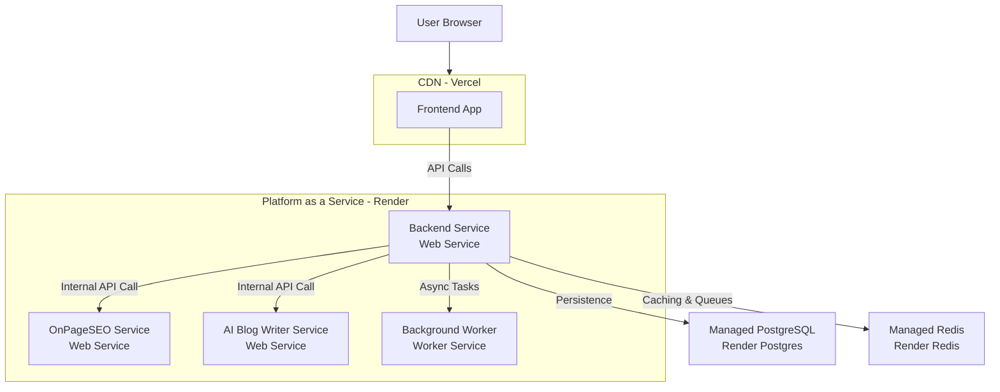

inspired from https://app.seobotai.com/

 # 📋 Complete Feature List of MangoSEO

### 1. **AI-Powered Content Generation**

* Automatic research of website, audience, and keywords.
* SEO-optimized article generation (Listicles, How-to Guides, Checklists, Q\&A, Versus, Roundups, Ultimate Guides).
* Article length: **\~3000–4000 words** (long-form).
* Supports **50+ languages**.
* Rich media insertion:
  * Images (Google Images- prefer nano banana model)
  * YouTube video embeds
  * Tables & lists
* Automatic **internal & external linking**.
* Backlinks (volume depends on plan, e.g., Enterprise).
* **Google scraping & research** for top-performing competitor analysis.
* **Facts checking system** with **source citations**.
* **Anti-hallucination reflection** (reduces AI factual errors).
* **Anti-typo** and grammar correction.

### 2. **SEO Content Analysis & Blueprinting**

* Analyze **top 10–30 Google results** for a target keyword.
* Generate a **blueprint report** including:

  * Recommended headings (H2/H3 structure).
  * **Semantic keywords (LSI terms)** to include.
  * Recommended **optimal content length**.
  * **Questions to Answer** (from Google PAA, forums, etc.).
  * **Sentiment analysis** of top content.

### 3. **Content Planning & Scheduling**

* Create **weekly content plans** based on site analysis.
* Users can **approve, decline, or moderate** AI-suggested articles.
* Content scheduling tied to subscription tier (e.g., 3–300 articles/month).

### 4. **Content Lifecycle Management**

* **Regular article updates** to keep content fresh.
* **Monthly article re-linking** for SEO (refreshes internal links).

### 5. **SEO Auditing**

* Website crawling to detect issues such as:

  * Missing meta tags
  * Slow page speed
  * Broken links
  * Image optimization problems

### 6. **Keyword Research & Clustering**

* Find new keyword opportunities.
* **Keyword clustering**: group related terms (e.g., “best coffee maker,” “coffee machine,” “coffee brewer”).

### 7. **Rank Tracking**

* Track daily Google search rankings for target keywords.
* Monitor **impressions, clicks, CTR** over time.

### 8. **Internal Linking Engine**

* Automatically links new articles to relevant site pages.
* Improves **navigation** and **SEO structure**.

### 9. **CMS Integration & Auto-Sync**

* **Auto-sync publishing** directly to CMS.
* Supported CMS:

  * WordPress
  * Webflow
  * Ghost
  * Shopify
  * Wix
  * Notion
  * HubSpot
  * Framer
  * Bits & Bytes- to be built - frontend and backend ai builder
* Developer Integrations:

  * **Next.js**
  * **REST API**
  * **Webhooks**

### 10. **Analytics Dashboard**

* Usage stats:

  * Articles generated
  * Impressions
  * Clicks
  * CTR
* Subscription details (plan, limits, renewals).
* Notifications.
* **Directory listings** (Enterprise tier).

### 11. **Subscription Management**

* Tiered pricing plans:

  * Starter: \$19/mo – 3 articles
  * Beginner: \$49/mo (14% off) – 9 articles
  * Pro: \$99/mo (22% off) – 20 articles
  * Ultimate: \$199/mo (37% off) – 50 articles
  * Enterprise: \$499/mo – 100 articles + 20 backlinks/mo
  * Extra: \$799/mo (40% off) – 150 articles
  * Mega: \$1499/mo (45% off) – 300 articles
* All tiers include:

  * \~3000 words/article
  * Images + YouTube videos
  * Backlinks + internal/external linking
  * Google scraping, fact-checking, anti-hallucination
  * Regular updates & monthly re-linking
  * CMS auto-sync + integrations
* Payment & billing handled via **Lemon Squeezy, Stripe, or Dodo**.
* Supports subscription changes, cancellations, renewals.

### 12. **User Profile & Settings**

* Displays:

  * User information
  * Uploaded articles
  * Subscription status
  * Usage analytics
* Allows:

  * CMS integration setup
  * Notification preferences

### 13. **Testing & Security (Platform Reliability)**

* **Unit Tests**: Jest + React Testing Library.
* **API Tests**: Postman / Supertest.
* **Security Tests**: OWASP ZAP vulnerability scanning.
* **Performance Tests**: Lighthouse for speed & SEO.

### 14. Automated Onboarding → 4 features

* *** **One-click onboarding (just URL + Go)
* **Auto research of site, audience, keywords
* **Auto content plan generation
* **Agent workflow (100s of tasks/jobs per article) 

### 15. Automated Listing 

- after scraping main business website- from earlier results
- finds all relevant places on the web (directories, forums, launchpads, business sites...)
- lists you everywhere, filling out all those boring forms
- does it in a way that's safe with zero risks (slowly over time)

MAIN EDITOR LAYOUT:
____________________________________________________
| Header (full width)                              |
|__________________________________________________|
|                                                  |
|   Left Column (60-70%)      | Right Column       |
|   _________________________ | __________________ |
|   |                       | | |                | |
|   |     TERMINAL IO       | | |  Content Queue | |
|   |                       | | |                | |
|   |   - Live AI logs      | | |   - Articles   | |
|   |   - Green/yellow text | | |   - Metrics    | |
|   |   - Avatar overlay    | | |   - Actions    | |
|   |_______________________| | |________________| |
|                           |                      |
|   Conversation Flow:      |                      |
|   _______________________ |                      |
|   | Chat Message        | |                      |
|   | Chat Message        | |                      |
|   | INPUT FIELD         | |                      |
|   | [URL input/buttons] | |                      |
|   |_____________________| |                      |
|                           |                      |
|___________________________|______________________|
| Footer/Status Bar (full width)                   |
|__________________________________________________|

You do not need the user’s raw login email & password.
Instead, most CMS platforms (WordPress, Ghost, Medium, Webflow, HubSpot, etc.) provide API keys, OAuth tokens, or service accounts that your backend can use.
With that credential, your system can:
GET /posts/{id} → fetch the current article
update the content body (inject internal links, fix formatting, etc.)
PUT /posts/{id} → save changes
To the CMS, it’s just a normal edit operation on an already published article.
So whether you are:
regenerating the entire blog post, or
surgically editing one section to insert links
…the permission requirement is the same: you need a valid CMS credential from the user.
✅ But you don’t need to unpublish/re-publish — you just “edit live content” through their CMS API.
Dynamic relinking means you don’t physically edit or republish the article each time you add/update links. Instead, you store link relationships in your database (e.g., article_internal_links table) and then inject those links at render time when a reader requests the article.
So the article stays untouched in the CMS, but the user (and search engines) always see the latest set of cross-links when the content is delivered.
Think of it like:
Blog content = static text in database
Links = an extra “layer” added on top dynamically before serving

The Smart Solution → Separate Links From Content
Instead of burning links into your content forever, you:
Store clean content (just plain text, headings, paragraphs — no hardcoded internal links).
e.g., keep "AI in small business marketing is growing rapidly." instead of <a href="/ai-tools">AI in small business marketing</a>.
Store links in DB (e.g., article_links table).
At render time (when blog is displayed or exported to CMS):
Find the first matching keyword/phrase in the text.
Wrap it with <a href="..."> automatically.
Apply filters:
Only latest 4 links per article
Don’t repeat anchor text
Prioritize earlier paragraphs (for SEO weight)

Excellent questions. Let's break them down one by one.

---

### 1. **Can we deploy to a user's custom Next.js website? Is it difficult?**

**Yes, but it's more complex than a traditional CMS.** Here’s why and how:

Next.js websites are not databases with a standard API; they are **static or server-rendered applications**. To add content, you typically need to:

1.  **Add content to their data source** (e.g., a headless CMS like Contentful, Sanity, a database, or local Markdown files).
2.  **Rebuild and redeploy the site** so the new content is generated.

#### How to Implement Next.js Integration:

**Option 1: The "Headless CMS" Method (Easiest for Us)**
This is the most realistic approach. We don't push to their Next.js codebase. Instead, we push to a headless CMS *they connect to their site*.
*   **How it works:** The user gives us API keys for their headless CMS (e.g., Contentful, Sanity, Strapi). We publish the blog post there using our existing `CMSApiClient`.
*   **Their responsibility:** Their Next.js site is already built to fetch content from this CMS. The new post appears automatically (or after a rebuild).
*   **Is it difficult for us?** No. It's identical to supporting any other CMS.

**Option 2: The Git Push Method (Complex)**
*   **How it works:** We get write access to their GitHub/GitLab repository. We create a new Markdown/JSON file for the blog post, commit it, and push.
*   **What happens next:** This triggers a build hook (e.g., on Vercel/Netlify) which rebuilds and redeploys their site with the new content.
*   **Is it difficult for us?** **Yes, very.** It requires robust error handling for git operations, security around user repo access, and handling build failures. **Not recommended initially.**

**Option 3: Direct Database Write (Very Complex & Rare)**
*   **How it works:** We get direct database credentials and write the article to their `posts` table.
*   **Is it difficult for us?** **Extremely.** It's a security nightmare, requires endless custom configuration per user, and is incredibly fragile. **Avoid this.**

**Conclusion:** Support Next.js **by treating it as a headless CMS consumer**. Ask the user to provide the API credentials for the CMS their Next.js site uses. This is standard practice and fits perfectly into your existing architecture.

---

### 2. **"Users might only have an endpoint for blogs"**

This is a great and common scenario. If a user has a custom-built website with a **RESTful API endpoint** (e.g., `POST /api/admin/posts`), integration is straightforward.

1.  **We create a new "Generic REST API" connector** in your `CMSApiClient`.
2.  The user provides:
    *   The API Endpoint URL (e.g., `https://theirwebsite.com/api/posts`)
    *   An API Key (e.g., in the `Authorization` header)
3.  Your `CMSApiClient` formats the blog post as JSON and sends a `POST` request to their endpoint.

This is easier than a full Next.js integration because you're just talking to a custom API.

---

### 3. **Should we reduce pricing if we can't do "direct" Next.js integration?**

**No. You should not reduce your price.**

*   **Your core value proposition is generating stunning, SEO-optimized content.** The publishing method is a convenience feature.
*   **Publishing to a headless CMS or custom API endpoint provides the exact same value** as publishing to WordPress. The end result is a live blog post on their site.
*   **Frame it correctly:** You support all major platforms (WordPress, Webflow, etc.) and **any platform that has a REST API** (which includes Next.js sites with a backend). This covers 99.9% of use cases.

You are not offering a "WordPress publishing service"; you are offering a **"content generation and publishing service"**. The channel is secondary.

---

### 4. **What is On-Page SEO? (as done by Otto SEO)**

**On-Page SEO** refers to the practice of optimizing elements **on your website** that are within your control to rank higher in search engines.

**Otto SEO's approach is advanced and technical. Here’s what it typically involves, which you should emulate:**

1.  **Content & Keywords:**
    *   **Primary Keyword Targeting:** Ensuring the main keyword is in the title, headers, and body.
    *   **Semantic SEO:** Using LSI (Latent Semantic Indexing) keywords – related terms and concepts – to help Google understand context and depth.
    *   **Topic Clusters:** Creating content that covers a topic comprehensively to become an authority.

2.  **Technical HTML Elements:**
    *   **Title Tag:** The clickable headline in search results (~60 chars).
    *   **Meta Description:** The summary under the title (~160 chars).
    *   **Header Tags (H1, H2, H3):** Properly structuring content with keywords.
    *   **URL Slug:** Clean, readable URLs containing the keyword (`/best-on-page-seo-tips`).
    *   **Image Optimization:** Using descriptive filenames and `alt` text.

3.  **User Experience (UX) & Content Quality:**
    *   **Readability:** Using short sentences, paragraphs, and bullet points. This is where your `ReviewAgent`'s readability score is key.
    *   **Content Freshness:** Regularly updating content (your "monthly re-linking" feature).
    *   **Internal Linking:** Linking to other relevant pages on your own site to keep users engaged and spread "link equity."
    *   **External Linking:** Linking to high-authority external sources to build trust and credibility.

4.  **Advanced Technical SEO (Where Otto Excels):**
    *   **Schema Markup:** Adding structured data (JSON-LD) to your code to help Google understand your content and generate rich snippets.
    *   **Core Web Vitals:** Optimizing for loading speed, interactivity, and visual stability. This is more for developers but your content can be optimized for it (e.g., image compression).
    *   **Crawling & Indexation:** Ensuring search engines can find and understand all important pages.

**Your `ReviewAgent` should check and implement most of points 1, 2, and 3.** Points 1 and 2 are already in your strategy. Point 3 (Internal/External Linking) is your killer feature.

### Summary & Action Plan:

1.  **For Next.js/Custom Sites:** Do **NOT** try to push to Git. Instead, support:
    *   **Headless CMSs** (Contentful, Sanity, Strapi) via your `CMSApiClient`.
    *   **Generic REST API Endpoints** by adding a new "Custom API" connector.
2.  **Pricing:** Keep your pricing as-is. You are providing the core value (content). Publishing is a feature.
3.  **On-Page SEO:** Double down on your current strategy. You are already following best practices. Emulate Otto's focus on **comprehensive content, semantic keywords, and strategic linking**.

Frontend, Bakcned and Microservices deployment 
Exactly 👍 — let’s unpack what that Render-based strategy actually means:

---

### 🔑 The idea is:

* **Frontend** is deployed separately on **Vercel** (best-in-class CDN + edge rendering).
* **Backend** is deployed on **Render** as a **public Web Service** (this is your API gateway).
* **OnPageSEO** and **AI Blog Writer** are **separate private Web Services** on Render.
* All three (Backend, OnPageSEO, AI Blog Writer) are deployed **separately** on Render but within the **same Render network**.

So, the **backend orchestrates** requests and internally calls the OnPageSEO and AI services. Those two services are not exposed to the public internet — only the backend can talk to them.

---

### ✅ Why separate instead of bundling into one backend service?

* **Isolation:** If one service crashes (say AI Blog Writer), it won’t take down your backend or SEO service.
* **Scaling flexibility:** Maybe OnPageSEO is CPU-heavy while AI Blog Writer is memory-heavy. You can scale them **independently**.
* **Deployment independence:** You can deploy fixes to AI Blog Writer without redeploying backend.
* **Security:** Private services are not exposed to end users, reducing attack surface.

---

### 🏗️ The actual setup looks like:

* **Frontend (Vercel)** → API calls → **Backend (Render public service)**
* **Backend** → internal network calls → **OnPageSEO (Render private service)**
* **Backend** → internal network calls → **AI Blog Writer (Render private service)**
* **Backend** ↔ **Postgres / Redis (Render managed services)**

---

### 📌 Answer to your question

> does this mean deploy frontend separately and backend separately with ai blog writer and onpageseo service separately on same platform but separately or not?

✅ Yes:

* **Frontend:** separately on **Vercel**.
* **Backend, OnPageSEO, AI Blog Writer:** all deployed **separately** as different services on **Render** (but inside the same Render environment).

They are “separate” so you get scaling/security benefits, but they’re all still on the **same platform (Render)**, which makes networking and management dead simple.

Absolutely. Yes. For a project at your stage, **using a Platform-as-a-Service (PaaS) like Render, Railway, or Heroku is a fantastic choice and often the smarter move over managing cloud VMs.**

It's not "skipping the cloud"—it's using a **higher-level, more managed** part of the cloud. This is the ideal path for avoiding DevOps overhead and focusing on your product.

Here’s the best-practice deployment strategy using Render:

---

### **The Render-Centric Production Architecture**

### **Why This is an Excellent Choice:**

1.  **Zero DevOps:** No managing servers, operating systems, firewalls, or VPCs. Render handles it all.
2.  **Built-in CI/CD:** You connect your GitHub repo. Every `git push` to your main branch automatically triggers a build and deployment. This is huge.
3.  **Simplicity:** Getting started is incredibly fast. You can have your entire backend live in minutes.
4.  **Cost-Effective for Early Stages:** Their free tiers are generous for low-traffic applications, and pricing scales predictably.

### **How to Deploy Each Service on Render:**

| Service | Render Service Type | Description |
| :--- | :--- | :--- |
| **Frontend** (Next.js) | **Static Site** on Vercel | Vercel is still unbeatable for frontends. Connect your repo, and it's done. |
| **Backend** (FastAPI) | **Web Service** on Render | The main public API. Gets a public `*.onrender.com` URL. |
| **OnPageSEO Service** (FastAPI) | **Private Web Service** on Render | **This is the key.** Deploy it as a **Private Service**. Only your Backend service (within Render's network) can talk to it. The public internet cannot access it directly. |
| **AI Blog Writer** (FastAPI) | **Private Web Service** on Render | Same as above. A Private Service for internal API calls. |
| **PostgreSQL** | **Render Postgres** | Use their managed PostgreSQL add-on. All Web Services can connect to it. |
| **Redis** | **Render Redis** | Use their managed Redis add-on for caching, queues, etc. |

---

### **Critical: Service Discovery & Communication**

How does the Backend service find the private URLs of `OnPageSEO` and `AI Blog Writer`?

**Render provides environment variables automatically.**
In your `Backend` service, you will have environment variables like:
-   `RENDER_INTERNAL_ONPAGESEO_SERVICE_URL=https://onpageseo-service:10000`
-   `RENDER_INTERNAL_AI_BLOG_WRITER_URL=https://ai-blog-writer:10000`

Your Backend code uses these variables to make internal requests.

### **The "Ideal Case" Summary**

| | Platform-as-a-Service (Render) | Cloud VMs (AWS) | Winner for You |
| :--- | :--- | :--- | :--- |
| **Setup Speed** | **Minutes** | Hours/Days | **Render** |
| **DevOps Overhead** | **None** | High | **Render** |
| **CI/CD** | **Built-in** | You build it | **Render** |
| **Networking** | Automatic | You configure VPC | **Render** |
| **Scaling** | Manual/Auto-scale | Highly configurable | Tie |
| **Cost Control** | Predictable | Can get complex | **Render** |
| **Learning Curve** | Minimal | Steep | **Render** |

**Conclusion:** For your goal of a "set it and forget it" production setup that doesn't require you to become a full-time DevOps engineer, **using Render for your backend services and Vercel for your frontend is the ideal choice.**

You can always migrate to a more hands-on cloud provider like AWS later if you outgrow Render's capabilities, but that is a good problem to have and the migration path is well-trodden. 