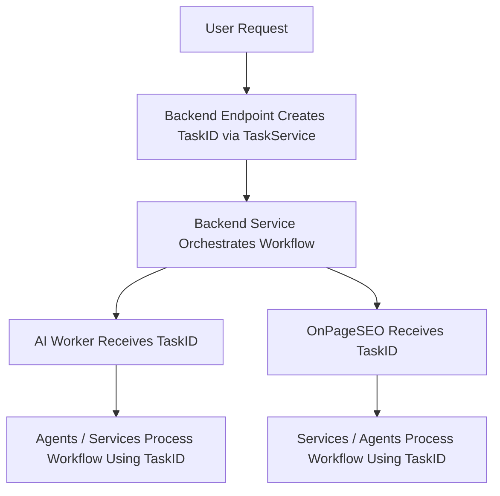

implement background tasks in onpageseo service too

uae tailwind instead of style={}

check each and every file for placeholders, features implemented for testing only and should not be in production 

fully guarantee multi-user concurrency isolation, you should:

Tie recommendations to both task_id + url_id (composite key).

Always fetch with .eq("task_id", task_id) when reading back audit results or recs.
make taskid mandatory everywhere 

make the blog post responsive across all devices

give me complete file with entire functionalities needed-    # make sure to directly call pipeline intsead of individual routes
also make sure our main editor is black and mango yellow - our webapp is only dark themed - dark black theme and orang eyellow gradient buttons 
do not add any new files, any new endpoints- implement funtionality into existing file folders

what is the purpose of this file 

check if this file needs further improvements 

do not use any as a type definition for errors or variables use only supabase and get rid of any postgres mentions, retain all other code lines, logic, only modify whats absolutely necessaryin all files imports are wrong- make sure to correct them according to file folder structure provided

create only one client for each in the entire project consolidate everything into one complete file, robust structure, all logic intactcheck if all the code in this file belongs to this very file and if we should delegate the code to some other file 
also check if there are any redundancies within the file with both backend and frontend

give me the updated file with all logic intact- all code lines untouched each and every line, retain each and every code line do not modify anything unless absolutely necessary , implement each and every suggestion provided, 

make sure all funcions use real ai and real services not just placeholders, make sure all funcions use real ai and real services not just placeholders

is the auth in this file actually necessary or it just contains redundant code from other files?- make sure you delegate any auth client creation to a single file- backend\src\core\security.py and supabase client creation to a single file- backend\src\integrations\supabase.py,   in order to provide duplicates

also check if each and every code, api integration is uptodate, check latest docs on official websites

also since supabase doent automatically create a profile table in db after first user authentication do we have to manually configure it? - also tell me according to curret file folder structure we do not have any types file like we use in nextjs since itis fastapi we only have models files are they enpugh, also give me a properly indented file

ues framer for all ui 
give me complete file with entire functionalities needed-    # make sure to directly call pipeline intsead of individual routes

also make sure our main editor is black and mango yellow - our webapp is only dark themed - dark black theme and orang eyellow gradient buttons 

use these clients everywhere # ai-worker/app/services/ai_clients.py

do not add any new files, any new endpoints- implement funtionality into existing file folders

need to update each agent  to accept and respect the language argument when generating 
 
implement the suggestions given 
 
make sure to implement this where exactly feasible and only give me the file implementation with all lines of code intact , no modifications  made unless absolutely necessary
also give me the exact snippet with exact locations where to modify this and not entire file

Make sure RLS policies protect sensitive data:
-- Example: only allow users to read their own profile
CREATE POLICY "Users can read their own profile"
ON profiles
FOR SELECT
USING (auth.uid() = id);

Just ensure:
RLS is enabled on your Supabase tables.
Any RPCs (retry_task, retry_subtask) exist in your DB.
Decide if you want to normalize task fetching (currently seo_tasks/blog_tasks vs update in tasks).
----------------------------------
check if we are accidently writing something to db in frontend 
   
in fronetnd check if we are directly calling supabase instead of using useuser hook?

should i remove all premium user decorators and check inside- your current setup, removing the @require_premium_user decorators and checking current_user.is_premium inside the endpoint is the safer approach.to-
Avoids decorator conflicts
require_premium_user likely uses Depends(get_current_user) internally.
If your endpoint also declares current_user: User = Depends(get_current_user), FastAPI tries to resolve the dependency twice → runtime errors or unexpected behavior.
More control over error handling
By checking is_premium inside the function, you can log errors, customize messages, or do additional logic before rejecting the request.
Consistency across endpoints
You’re already using get_current_user everywhere; keeping the premium check inside keeps the flow uniform.

Wherever you start the pipeline/orchestration (e.g., startPipeline()), check:
import { useUserSettings } from '@/stores/use-user-store';
const settings = useUserSettings();
if (settings?.autopilot) {
  startPipeline(); // trigger backend orchestration automatically
}

keep store fetch 
Race Conditions? ❌ NO - if implemented correctly
Zustand handles concurrent updates safely
Each user gets their own store instance per session
No shared memory between users
Re-renders? ✅ Optimized
Components only re-render when their specific selected state changes
100 users = 100 separate store instances (in different browser sessions)

implement tanstack 

check if we are unknowingly adding taskid to db in frontend -we should only use tempid for ui purposes and not persist anything to db

check what route do we have to add to 

implement autopilot logic - it is fake in editor.tsx now

check if we are using this anywhere and implement tailwind instead       style={{ backgroundColor: '#0a0a0a', borderRadius: 12 }} // Dark black theme

check if supabase calls use correct table names

for multiple user concurrency implement prop drilling instead of direct fetch 

can ypu check if we are passing right props whereevr necessary 

is the generated pixel code correct 

2️⃣ What to fetch in one main query
Safe to include in main fetch:
users.*
subscriptions.*
user_settings.*
website_configs.*
website_configs.blog_tasks.* without blog_results
website_configs.seo_tasks.*
Reason: These are relatively small objects and usually needed immediately on page load.
3️⃣ What to lazy-load separately
blog_results → can be thousands of rows per user
ai_recommendations, page_seo_data, performance_predictions

check this - If a task is inserted twice, Postgres will reject it based on PRIMARY KEY or UNIQUE constraints.check the number of total tasks for each ai blog writer run and onpageseo call- each api call 

also can we implement caching- similar logic to prevent users from starting backend pipleines multiple times?make sure rate limiting / deduplication is handled to avoid flooding the backend.

in aiworker the flow is this in bloggen pipeline- check if any agent is duplicating work instead of taking former agents data and passing it on ahead
 

in backend check if the files are duplicating and implementing ai service when they must onlyhandle business logic and delegate the ai working and ai implenmentation to ai worker 

in frontend check if the files are dupliating and implementing ai service when they must onlyhandle business logic and delegate the ai working and ai implenmentation to ai worker , also make sure that frontend only talks to backend and backend then talks to aiworker 

later use monitor.py for health check- after each deployment by pixel 

can we also implement a trending filter for blog topics generation?- allow users to toggle between trending and related topics

 website analysis, ideas generation,- curate headlines from topics approved and display o the fronetnd to generate/decline- if generated- approve/decline for scheduli/publishing , cross links generated blogs

notify users that cms sync is not available - two way blogpost updates are not implemented

for onpageseo   
Always keep the baseline (original analysis, user’s untouched page).
Keep each new recommendation as a draft until deployed.
When deployed, mark it active.
Allow rollback by switching version.
Frontend shows side-by-side diff:
Original vs Recommended (like GitHub PR view).
This builds trust and avoids “black box AI” frustration.
  

can we allow users to taks a snapshot of the recommenedations from dialog box- by vreating image using url.createobject("a") or any other method that is feasible- 

backend topics endpoint to accept url data, scrape url , save it in db. call ai worker api endpoint suggest-topics to use the scraped data from db and generate ideas and then save it to db 
 
 backend orchestrate endpoint to be called when user clicks on generate button in frontend to scrape website or use already scraped data, update db to add taskid along with topicid and call generate endpoint with the topic id recieved from backend orchestrate fetch the db for topic idea using topic id, pass it to outline agent to continue with blog generation flow- 

Backend subscribes to changes on the deployment_plans table via your real-time listener.
 
 also modify outline agent and outline prompt to accept 

add anti hallucination agent/logic- Prompt Engineering: The prompts used inside SEORecommender.generate_recommendations() should be carefully designed to instruct the AI to only use information from the provided analysis. For example: "Based ONLY on the following analysis data, generate recommendations: [insert analysis_result here]. Do not suggest fixes for issues that are not present in the data."
 
disclaimer- this flow is only for ai worker(bloggen) and not onpageseo
how is the flow actually taking place from frontend to ai worker to user- i have the ai worker flow- just an overview- the frontend calls topic/ from backend- which in turn handels taskid etc and calls ai worker;'s endpoint - /suggest-topics the topic ideas are generated then they are shown on frontend- when user clicks generate- the backend /orchestrate is called which calls ai worker's /generate using orchestration service- which generates blog and saves it to supabase- when user clicks approve in frntend- the blogpostid is updated to scheduled, then /publish-to-cms enpoint from backend is called which directly fecthes blogpost from db, formats it and then publishes it to cms- tell me in order to check this flow which files do you need

later clarify on the frontend that cms integrations are for blog writing only and not onpageseo

is the article generation process and other flow halted if the user closes the editor , how to achieve the flow where whem user onbaords url and then starts generating ideas or blogs, even if the user cloeses yje browser the flow is contibued= the topics/blogs are generated or if the user aproves gthe blog and schedukes it , the blogs are automatically published at the scheduled time  

also for each main application feature apply subscription check , credits left check and similar checks
also in each and every necessary file in backend and ai worker make sure to add credit limits - fetch user subscription and apply limits 
also what kind of credit system should we apply - make sure to consider we are using 3 ai agents and retry logic too

after deployment - enable cors and communication between each of them 
 

change pricing tier later 

🔹 What is OpenAPI → TS auto-generation?

PerformanceAgent → GSC integration + tracking (optional, later)- inside onpageseo 

  can we make sure that if one task fails the orchestrator retires it until it gets it right and can we also make sure that failing of one task wont affect other tasks qeued

also can we use alt text and desciption for both video and image placeholder?

You’ll need to store YOUTUBE_API_KEY in Supabase secrets (or .env). My code assumes you’ve got a helper like supabase_client.get_secret("YOUTUBE_API_KEY").

also can we define another function that includes a cta section with well defined button- white background a good visual context and a button redirecting to user's main website for business 

do any of these have any placehoholders? if yes then can you give me  real logic code instead of placeholder?also check if ai agents include placeholders instead of real ai 

if theres a custom prompt make sure it does not completely override our inline prompt as usrs can provide incomplete prompy, instead include that promtp inside inline prompy template

only 1-2 ai calls per agent no more since we have total 10 agents 

check for async supabase inside all files

only 1-2 ai calls per agent no more since we have total 10 agents 

mark whether each function in ai agent is needed or not also do each of them share data? are we returning a single json from one function in pipeline and not using other function data? cant we just aggrgate each result and finally return a combined json to pipeline?

also does this agent make use of 
Realtime data / API  
 
tell me how many ai calls does this agent make?

what is the purpose of this agent and what must be the output it must produce?

tell me is each and  every function necessary ? cant we consolidate everything that is redundant?

also does this agent have anything that is redundant with other agents?

does this agent have an orchestrator function that handles other functions also if yes then does the orchestrator call each and every other function so nothing is left behind?
 
are we calling all the clients correctly in all files and all mucroservices?

/seo/analyze → Single-page analysis - log cached result, but always runs fresh analysis- later modify it to handle logged cache instead of fresh analysis every single time 

check which serpapi initialisation is correct ?

also since we are also passing the paragrpah and headline in the prompt to the writing agent - the final blog output by the ai also contains headings for each section - tell me is it a norm to include headings too can we just tell ai to skip the headings and use them only for refernce- also if the output still contains headings for separate sections how can we get rid of them - instead can we just keep those headings as it is- use them later for indexing and hide them in frontend?

apply indexing to blog later 

In short: tables for ai blog writer 
blog_results → stores the complete blog draft, media assets, FAQs, and all final outputs.
strategy_summaries → stores a condensed summary of the content strategy.

implement correct taskid, user_id, url_id, website_url- flow also make sure that each api and each pipeline updates taskstatus- success/pending/failure for backend realtimelistener to listen 
🔹 1. Should API + pipeline both save task_id updates to DB?
Yes — but with diffeent purposes:
API:
Creates the initial record in pipeline_results with status "pending".
→ This ensures the frontend immediately has a task entry it can track.
Pipeline:
Updates that same record (status → running → completed/failed, plus content, metadata, scores, etc).
→ This ensures the record reflects the actual progress and results.
So:
👉 API = creates stub record.
👉 Pipeline = updates progress + results.
Without the API insert, the frontend wouldn’t know about the task until the pipeline finishes.
Without the pipeline updates, the task would never progress beyond "pending".
2. How should the realtime listener work?
The RealtimeListenerService is not responsible for writing to the DB — only for listening and reacting.
It should:
Subscribe to table-level updates (tasks, pipeline_results, topics, etc).
Filter by status (only trigger on "completed" / "failed", ignore "pending" / "running").
When triggered, it notifies frontend or triggers follow-up jobs.
So:
👉 Listener = reacts to DB changes.
👉 It should not be polling or calling the pipeline.
👉 It should listen at the table level (like pipeline_results), not just per task_id.
Filtering by task_id is something the frontend/websocket subscribers might do (e.g., only care about their task).
The backend listener should generally watch the whole table.
🔹 3. What is crrently implemented?
Looking at your realtime_listener_service.py:
It subscribes at the table level:
subscription = self.supabase.channel("pipeline_results_changes")
subscription.on(
    "postgres_changes",
    {
        "event": "UPDATE",
        "schema": "public",
        "table": "pipeline_results",
        "filter": "status=eq.completed",
    },
    self._handle_pipeline_completion)
✅ This means it listens to all updates on pipeline_results where status = completed.
Not per-task, but per-table — which is correct for backend orchestration.
Same for:
tasks table (status=eq.completed)
topics table (status=eq.completed)
publishing_jobs (all events)
articles (status=eq.ready)
So your listener is already doing the right thing: table-level subscriptions with filters on status.
Great question 👍 — let’s break it down carefully.
 

### 🔹 1. Do we have a `taskid` table in DB?

No — usually **`task_id` is a column**, not a standalone table.
Looking at your code, the DB tables are things like:

* `tasks`
* `pipeline_results`
* `topics`
* `publishing_jobs`
* `articles`

Each row in those tables has its own `id` or `task_id` field.

So → there is no `taskid` table, you can’t subscribe to “taskid updates.”
 
### 🔹 2. Should we listen to *every* table?

Not every table in the whole DB (that would be overkill).
Instead, only the **workflow-critical tables** where task progress or results are stored.

In your current listener you already have:

* `tasks` → for generic task status updates.
* `pipeline_results` → for blog generation progress/results.
* `topics` → for topic generation completion.
* `publishing_jobs` → for publishing events.
* `articles` → legacy article completion.

That’s the right set — **not everything, just the workflow tables.**
 
### 🔹 3. Why not just listen to `tasks` only?

You *could* collapse everything into `tasks` if your design is **centralized** (all jobs go into one table with type + status).

But your system currently uses multiple domain-specific tables (`pipeline_results`, `topics`, `publishing_jobs`, etc.), so:

* If you listen to `tasks` only → you’d miss updates from `pipeline_results` and others.
* If you listen to `pipeline_results` only → you’d miss SEO/onpage tasks and publishing events.

That’s why the listener subscribes to several tables. 

### 🔹 4. Is listening to multiple tables “cumbersome”?

Not really — Supabase realtime subscriptions are **lightweight**, and you’re filtering on `status`, so you only react to meaningful events.

It’s actually more **scalable**: each subscription is independent, and you avoid building a giant “catch-all” pipeline in one table. 

✅ **Final Answer:**

* There is no `taskid` table — `task_id` is a field inside other tables.
* The realtime listener should **not** subscribe to the entire DB, only to workflow-relevant tables (`tasks`, `pipeline_results`, `topics`, `publishing_jobs`, etc).
* If you want simplicity, you could consolidate into a single `tasks` table — but since you already have separate tables, listening to each one is the correct design. 

correct all db table names in all backend, microservices, frontend

remove dummy user_id generation logic from wherever possible

why is only 1 topic being saved instead of all 10 - 

modify every agent run supabase call since we are keeping two separate tables
await supabase_client.insert_into(
    "seo_agent_runs",
    SEOAgentRun(...).dict()
)
await supabase_client.insert_into(
    "seo_agent_runs",
    SEOAgentRun(...).dict()
)

include backgroundtask in onpageseo just like aiblogwriter

check if we should add pycache to gitignore

implement word count checks

enrich_with_search: bool = False, :strategy_agent
There’s a comma at the end, making it a tuple ((False,)) instead of a boolean.
This will always evaluate as True in if enrich_with_search and self.search_tool: — bug.

check redundant parsing in all agents

create a projects scroll in the footer - dynamic listing of all deployed projects from a shared file- constants, logos, names, urls

check if redis is actually used in ai blog writer and onpageseo 

for each and every supabase query check if the table names match with sql in db 

test webhooks before deployment

also dont we need to delete these since we only handle subscription db sync- and that is handled in api/webhooks 

do we need any third party apis, auth credentials in order to work with these integrations? 

backend\src\integrations\__init__.py
backend\src\integrations\base_cms_client.py
backend\src\integrations\bitsandbytes_client.py
backend\src\integrations\blogger_client.py
backend\src\integrations\custom_rest_api_client.py
backend\src\integrations\framer_client.py
backend\src\integrations\ghost_client.py
backend\src\integrations\hubspot_client.py
backend\src\integrations\medium_client.py
backend\src\integrations\notion_client.py
backend\src\integrations\shopify_client.py
backend\src\integrations\substack_client.py
backend\src\integrations\webflow_client.py
backend\src\integrations\wix_client.py
backend\src\integrations\wordpress_client.py
for each of these files give me purpose and what it contains-

also do we have to modify models / usersettings to include cms credentials or do we already have them ? 

All DB state changes → TaskService.
All worker control (start/stop) → SchedulerService.
Remove duplicate cancellation in tasks.py — it should just call into TaskService + SchedulerService.

according to these client files give me requirements.txt file - 

also make sure that all taskids are created in apis and sent to services

Pixel Script Security
fetch(apiUrl, { method: 'GET', headers: { 'Content-Type': 'application/json' } })
No authentication. Anyone with a pixel_id can fetch optimizations for any site.
⚠️ Could leak SEO strategies.

include=["backend.src.tasks"] i- check if this is the correct path for tasks.py after isolated deployment 

implement this So all endpoints that use Depends(get_current_user) become “protected” by Supabase JWT
When the client sends a request with Authorization: Bearer <JWT>:
FastAPI calls get_current_user. JWT is verified.user object is injected into your endpoint This allows all endpoints to be protected by simply adding Depends(get_current_user).

Implementation: Pass Authorization: Bearer <user_jwt> header from backend when calling microservice. Microservice must validate the JWT (reuse your get_current_user logic or a library).

What you do need is service-to-service auth, so that microservices can trust requests actually came from your backend and not from the public internet

check for unnecessary reinitialisation of services across apis instead if using singleton definitions 
check if we are passing 2️⃣ X-Internal-Secret: <secret> and not 1️⃣ Authorization: Bearer <token> for microservice-to-microservice calls.

tell me how to implement this - give me exact location also keep placeholder for realtimelistener we will integrate it later in usecmstore 

1️⃣ Role of Celery vs Scheduler Service
| Component                                      | Primary Role                                                                                                                                                                        | Why Both Exist                                                                                                             |
| ---------------------------------------------- | ----------------------------------------------------------------------------------------------------------------------------------------------------------------------------------- | -------------------------------------------------------------------------------------------------------------------------- |
| **Celery**                                     | Distributed task queue & execution engine. Handles asynchronous execution, retries, and periodic/scheduled tasks.                                                                   | Celery itself doesn’t know *what tasks to run, when to schedule them, or how to orchestrate them*. It just executes tasks. |
| **Scheduler Service** (`scheduler_service.py`) | Central orchestration layer in your backend. Decides **what should run, when, and under what conditions**. Keeps metadata, tracks scheduled tasks, coordinates with `task_service`. | Provides a **backend-friendly abstraction** over Celery. API endpoints and services don’t need to know Celery internals.   |
[API Endpoint] 
    |
    | (request to run task)
    v
[Scheduler Service] ---> Checks task type, user, timing
    | 
    v
[Celery] ---> Executes task asynchronously / periodically
    |
    v
[Task Service] ---> Updates task status, logs, retry handling
    |
    v
[Microservices / Services] ---> Executes actual business logic

tell me what to change - added website_id instead of url - what does blog_result table contain - webiste_id 

are these two consistent execute_blog_creation and run_with_retry - do they follow similar logic?

 also tell me how to add these? 
 serpapi key
 youtube api key
 cloudinary keys 
 gemini nano api 

 also tell me what all must be the allowed cors origins?

 also tell me are we implementing rate limitng-

 if decided to allow supabase oauth using google- how should we implement it in all- frontend,backend, onpageseo and ai blog writer? do we have to use auth bearers or similar logic ?

tell me since backend is talking to onpageseo, fronetnd and aiblogwriter do we need fastapi in there too? 

also what do we actually need to pass everywhere userid, websiteurl , wensite_id/url_id - isnt the user's main website only used for onpageseo - 

check if mulitple (10 urls)- are being accepted for onpageseo -

also only 1 instead of  10 blog topics are saved froma a total of 10 topics generated 

how can we implement the topic approved/rejected in backend/frontend ?

what must the taskid field contain? chcek for both microservices

what should be the flow for taskid- backend must create it using taskservice- initate pending status , microservices must recieve the taskid, in api/pipeline the taskid must be updated to processing - after supabase save it must be updated to success

also what must the realtime_listener_service listen to ? taskid updates fo rboth microservices or each table updates ? should it focus on taskid table updates also on mian final result updates like blog_results , ai_recommendations, cms publishing_jobs

also do we need to have more tables in backend for cms publishsing/ calendar -

 do we need to add more social media accounts, using theor passowrds/auth for user accounts- or does the cms have its own api and credentials for handling that ? what more should we add to user table?

 what is the use of this file  
 backend\src\tasks.py

 also should i copy paste supabase client logic from aiblogwriter into backend

 check backend vs ai worker file 

 this is the file folder structure in backend - tell me the use of each and every file also if it is redundant with all other microservices files?

also cn we make onpageseo also instant liek blog writer using backeground task logic?

also how are we using cleery - what tasks must be scheduled? cms publisging blog?  seo deployment using pixel?

what is this cms api client- what all things must it contain?

should i also copy middleware logic from ai blog writer into backend ?

what a;; should all middlewares contain ? supabase, redis, cloudinary, api logic , anyhting else? are all these important ? right now we only have db middleware 

does our application support multiple user concurrency? 

what is the use of router.py file ? do we need it in all fastapi applications ? right now we only have it in backend and not microservices?

add indexing to db tables and columns 

add cache invalidation logic (e.g., when recommendations are updated or re-approved by a user), or is caching short-term (TTL 300) good enough for now?

also why are we directly loging into task specific tables instead of blogtasks/seotsaks- cant check where are we actually tusing these - if not can we remove it?- check all tables in db , amrk the ones that track taskids and tell me which ones are really needed and which ones can we incorporate into blogtakss/seotasks 

also check if the backend\src\utils\content_helper.py correctly formats the blog before pupblishing according to blog sections= cross check with contentpipeline in aiblogwriter 

Option B: Async parallel publishing
async def publish_single(cred):
    client = await create_cms_client(cred)
    return await client.publish_article(article_data)
tasks = [publish_single(cred) for cred in user_all_cms_credentials]
results = await asyncio.gather(*tasks, return_exceptions=True)
Pros: Faster, publishes to all CMS simultaneously.
Cons: Slightly more complex error handling.
✅ Best approach: Use async parallel if multiple CMSs are common.

Do you actually need a shutdown in BlogGenerationService?

Yes, if your service holds resources that need clean-up:

Long-running background listeners

Open connections to microservices

Any other asynchronous tasks that should gracefully stop

No, if everything is handled elsewhere:

In your case, the realtime_listener_service already has a stop_listening() call in shutdown.

BlogGenerationService itself currently does not hold any extra resources that need explicit cleanup.

cehck if we actually need to start all services in main.py during startup?

for inputs - enable enter submission

implement rate limiting without breaking other files 

check cors origin implementation for all 
 

## **1️⃣ Backend**

### **Task ID GENERATORS (use `TaskService.create_task()`)**

These are **backend endpoints or services that start a workflow**:

* `backend\src\api\v1\endpoints\blog_generation.py` → generates task ID for blog generation workflows (calls AI Worker)
* `backend\src\api\v1\endpoints\blog_topic_generation.py` → generates task ID for topic generation
* `backend\src\api\v1\endpoints\seo_analysis.py` → generates task ID for website SEO analysis
* `backend\src\api\v1\endpoints\seo_deploy.py` → generates task ID for deploy workflow
* `backend\src\api\v1\endpoints\publish_cms.py` → generates task ID for CMS publishing 
* `backend\src\services\scheduler_service.py` → generates task ID if scheduling a workflow
* `backend\src\services\blog_generation_service.py` → accepts task\_id from endpoint, coordinates blog workflow (previously `orchestration_service`)
* `backend\src\services\seo_workflow_service.py` → accepts task\_id from endpoint, coordinates SEO workflows

> ✅ **All other backend services and endpoints just ACCEPT task\_id**.

### **Task ID ACCEPTORS (do not generate)**

* `backend\src\services\crosslinking_service.py`
* `backend\src\services\pixel_service.py`
* `backend\src\services\publish_cms_service.py`
* `backend\src\services\realtime_listener_service.py`
* `backend\src\services\user_service.py`
* `backend\src\tasks.py` → only receives task\_id for Celery/async execution

---

## **2️⃣ AI Worker**

**All AI Worker files accept task\_id** — **they never generate it**.

### **Task ID ACCEPTORS**

* `ai_blog_writer\app\api\endpoints\generate_blog.py`
* `ai_blog_writer\app\api\endpoints\suggest_blog_topics.py`
* `ai_blog_writer\app\agents\writing_agent.py`
* `ai_blog_writer\app\agents\strategy_agent.py`
* `ai_blog_writer\app\agents\review_agent.py`
* `ai_blog_writer\app\services\ai_clients.py`
* `ai_blog_writer\app\services\cache.py`
* `ai_blog_writer\app\services\cloudinary.py`
* `ai_blog_writer\app\services\redis_client.py`
* `ai_blog_writer\app\services\serpapi.py`
* `ai_blog_writer\app\services\supabase_client.py`
* `ai_blog_writer\app\pipelines\content_pipeline.py`
* `ai_blog_writer\app\tools\google_search_tool.py`

> **Other files (`core`, `middleware`, `main.py`)**: task\_id may be passed through or ignored, never generated.

---

## **3️⃣ OnPageSEO Service**

**All OnPageSEO files accept task\_id** — **they never generate it**.

### **Task ID ACCEPTORS**

* `onpageseo-service\app\api\v1\endpoints\analyze.py`
* `onpageseo-service\app\api\v1\endpoints\deploy.py`
* `onpageseo-service\app\services\analyzer.py`
* `onpageseo-service\app\services\deployer.py`
* `onpageseo-service\app\services\monitor.py`
* `onpageseo-service\app\services\recommender.py`
* `onpageseo-service\app\agents\keyword_agent.py`
* `onpageseo-service\app\agents\schema_agent.py`
* `onpageseo-service\app\agents\semantic_agent.py`
* `onpageseo-service\app\clients\*` → all client services accept task\_id

> **Other OnPageSEO files** (`core`, `middleware`, `utils`, `main.py`) → do not handle task\_id except for passing/propagating it if needed.

---

## **4️⃣ Backend vs AI Worker flow example**

